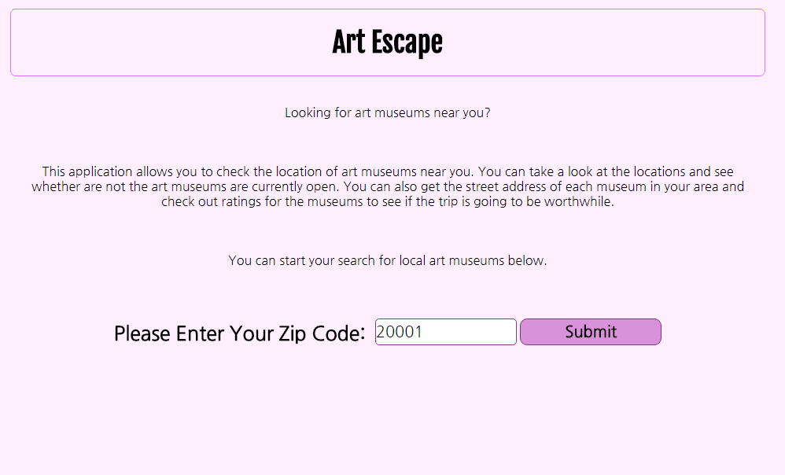
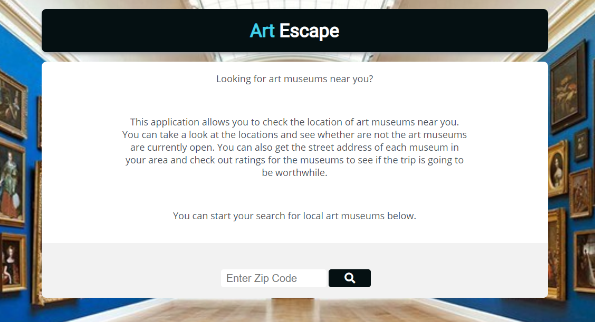

Art Escape
	This application allows you to check the location of art museums near you. You can take a look at the locations and see whether are not the art museums are currently open. You can also get the street address of each museum in your area and check out ratings for the museums to see if the trip is going to be worthwhile.

Features:
- Be able to search Art museums within 4,000 meters of given zipo code
- Be able to view the ratings of each result
- See the name and address of each result
- Be able to search multiple zipcodes without reloading the application

Instructions:
1. Clone Repository
```
git clone https://github.com/scareycs/ArtMuseums.git
```
2. Install dependencies
```
npm install
```
3. Start web server
```
http-server
```
4. Go to "http://localhost:8080/" in your browser


Screenshots:


